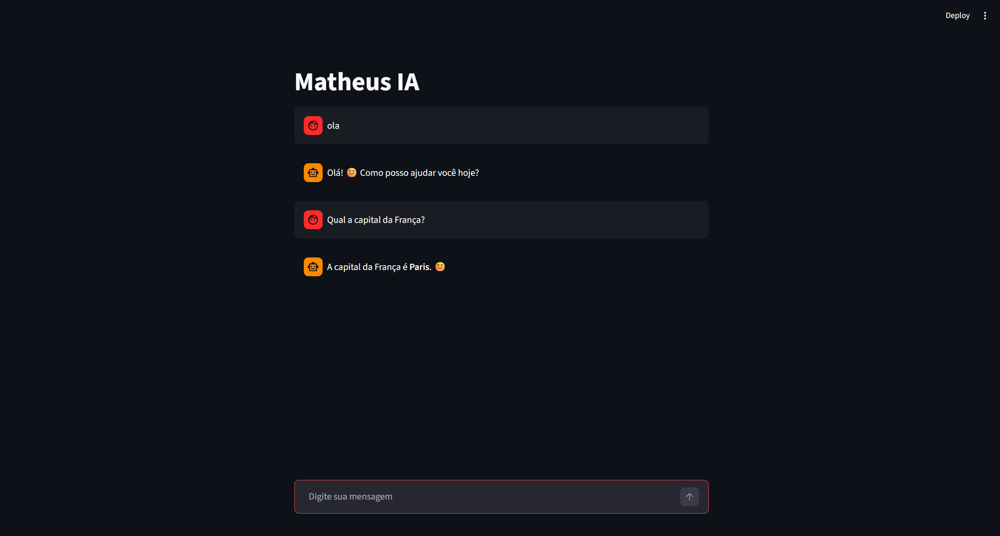

# Chat IA Local com Streamlit

Interface de chat estilo ChatGPT conectada a uma IA rodando localmente.

## Como funciona

- Interface construída com Streamlit
- Conecta a um servidor LLM local via API OpenAI compatível
- Mantém histórico de mensagens durante a sessão

## Requisitos

- Python 3.10+
- LM Studio ou Ollama rodando localmente na porta 1234
- Modelo utilizado: qwen/qwen3-4b-2507

## Instalação

```bash
pip install streamlit openai
```

## Como usar

```bash
streamlit run chat-ia.py
```

Certifique-se de que o servidor LLM local está rodando antes de iniciar.

## Dependências

As dependências estão listadas em `requirements.txt`. Para instalar:

```bash
pip install -r requirements.txt
```

## Configuração

Por padrão o app conecta em `http://127.0.0.1:1234/v1`. Caso seu servidor
LLM esteja em outra porta, altere a variável `BASE_URL` no topo do arquivo `chat.py`.

O modelo pode ser trocado alterando a variável `MODELO` no topo do arquivo.

## Demonstração


